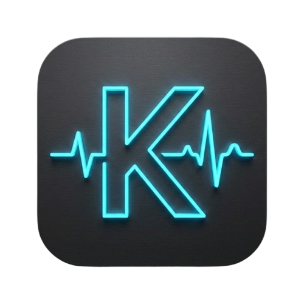
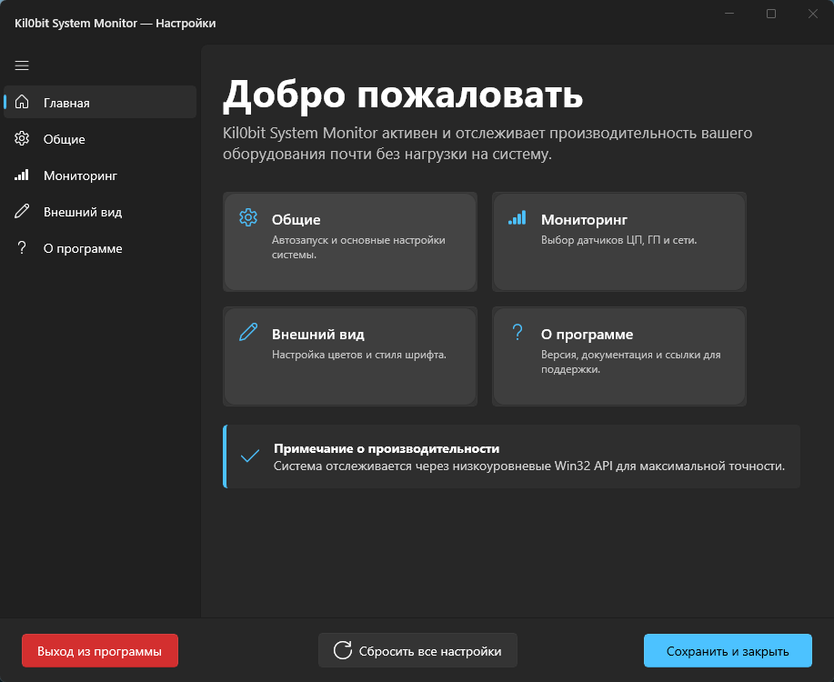
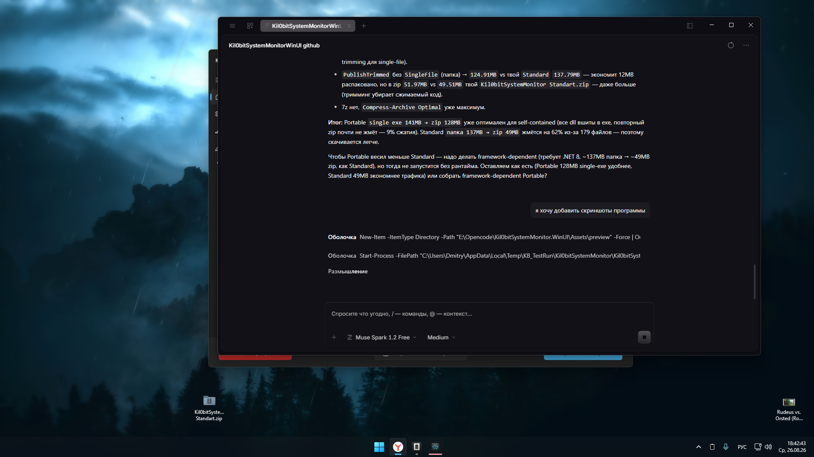

# Kil0bit System Monitor — WinUI 3 Edition

<div align="center">



**Advanced Hardware Telemetry Overlay for Windows 11 — переписан на WinUI 3 / Windows App SDK**

Форк оригинала **kil0bit System Monitor v3 (WPF)** → портирован на **WinUI 3**

[](https://dotnet.microsoft.com/en-us/download/dotnet/8.0)
[](https://learn.microsoft.com/en-us/windows/apps/winui/winui3/)
[](LICENSE)
[]()

> **Оригинал:** https://github.com/kil0bit-kb/kil0bit-system-monitor  
> Автор оригинала: **KB - kil0bit** — [@kilObit](https://www.youtube.com/@kilObit) | [Blog](https://kil0bit.blogspot.com/) | [Patreon](https://www.patreon.com/cw/KB_kilObit)

</div>

---

## 🔀 Что это?

Это **форк** [kil0bit-kb/kil0bit-system-monitor](https://github.com/kil0bit-kb/kil0bit-system-monitor) с полной переработкой UI-слоя на **WinUI 3**:

| Аспект | Оригинал (v3) | Данный форк (v4.0.0 WinUI 3) |
|---|---|---|
| **UI Framework** | WPF + ModernWPF | **WinUI 3 + Windows App SDK 1.8** |
| **Graphics** | Win32 GDI+ (BitBlt, AlphaBlend) | WinUI 3 composition + Win32 overlay |
| **Оконная система** | WPF Window | `Microsoft.UI.Xaml.Window` + `OverlayWindow.cs` (AppWindow) |
| **Настройки** | `SettingsWindow.xaml` (WPF) | `MainWindow.xaml` — `NavigationView` WinUI 3 |
| **Target** | `net8.0-windows` (WPF) | `net8.0-windows10.0.19041.0` (WinUI 3) |
| **Упаковка** | `WindowsPackageType: None` | `UseWinUI=true`, `WindowsAppSDKSelfContained=true` |
| **Локализация** | — | `Helpers/Loc.cs` |
| **Телеметрия** | `TelemetryService`, `AmdAdlService` | те же сервисы, адаптированы под WinUI 3 |

Логика мониторинга (`Services/TelemetryService.cs`, `Services/AmdAdlService.cs`, `Services/ConfigService.cs`, `Models/SystemMetrics.cs`) сохранена и основана на оригинале.

---

## ✨ Возможности

- 🚀 **Оверлей в таскбаре** — всегда на виду, не мешает работе
- 📊 Мониторинг **CPU / GPU / RAM / Network / Disk (multi-disk 3×3)**
- 🎨 Пиксель-перфект рендер, поддержка High-DPI, Mica/темная тема WinUI 3
- ⚙️ Гибкие настройки: сенсоры, цвета, интервалы обновления, автозапуск
- 🪶 Лёгкий, без Electron, нативный .NET 8
- 🔧 `OverlayWindow.cs` — нативный Win32 overlay поверх таскбара

---

## 📸 Скриншоты

> Добавь свои скриншоты в `Assets/preview/` и обнови пути ниже

| Dashboard (WinUI 3 NavigationView) | Overlay |
|---|---|
|  |  |

---

## 📂 Структура проекта

```
Kil0bitSystemMonitor.WinUI/
├── App.xaml / App.xaml.cs          # WinUI 3 Application entry
├── MainWindow.xaml(.cs)            # Настройки — NavigationView
├── OverlayWindow.cs                # Прозрачный оверлей (AppWindow + Win32)
├── Helpers/
│   ├── Loc.cs                      # Локализация
│   ├── Win32Helper.cs              # Win32 interop
│   └── Converters/                 # BoolToVisibility, HexToBrush
├── Models/
│   ├── SystemMetrics.cs
│   └── DiskSelectionItem.cs
├── Services/
│   ├── TelemetryService.cs         # CPU/GPU/RAM/Network/Disk
│   ├── AmdAdlService.cs            # AMD ADL
│   ├── ConfigService.cs            # JSON persistence
│   └── StartupService.cs           # Автозапуск
└── ViewModels/MainViewModel.cs
```

---

## 🙏 Благодарности и оригинал

Весь исходный дизайн, идея и большая часть логики телеметрии принадлежат автору оригинала:

**KB - kil0bit** — https://github.com/kil0bit-kb/kil0bit-system-monitor

Этот форк создан с уважением к оригиналу и распространяется под той же **MIT License**.  
Если тебе нравится оригинал — поддержи автора: [Patreon](https://www.patreon.com/cw/KB_kilObit) | [YouTube @kilObit](https://www.youtube.com/@kilObit)

> **Fork Notice:** This is an unofficial WinUI 3 port. The original WPF project is at https://github.com/kil0bit-kb/kil0bit-system-monitor

---

## 📄 Лицензия

MIT — см. [LICENSE](LICENSE)

Copyright (c) 2026 KB - kil0bit (original), WinUI 3 port modifications by contributors.
